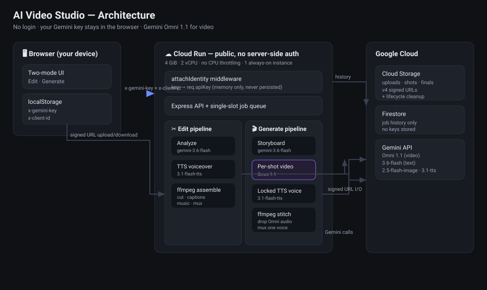
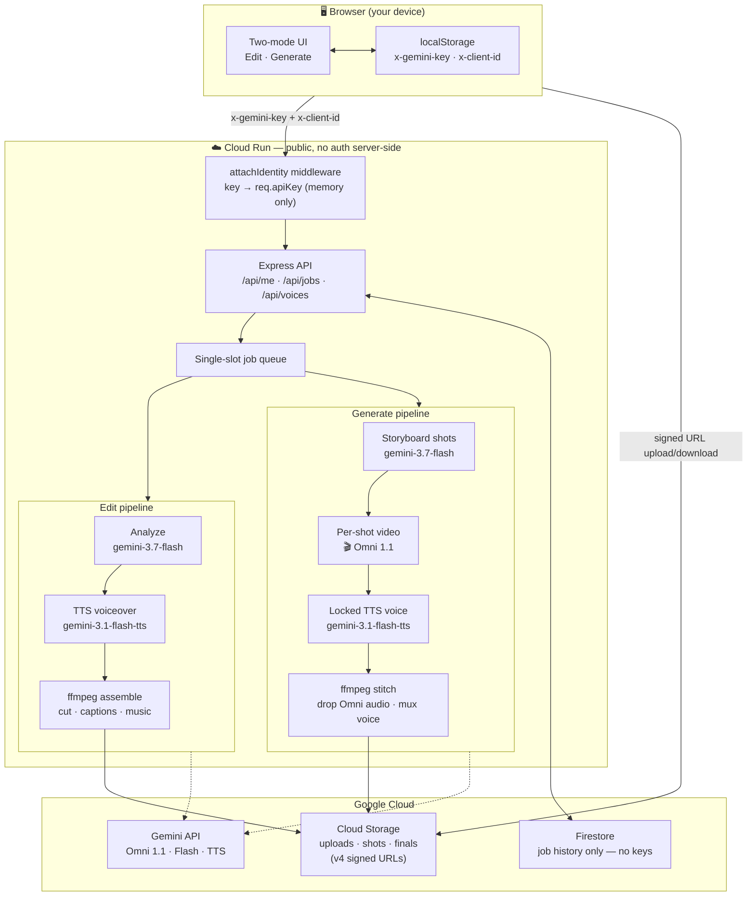

# How to Generate a 60‑Second Video With Gemini Omni 1.1 in One Click — Using Your Own Face

*Upload a photo of yourself, describe an idea, and get a full minute of video where the same person appears in every shot — with one consistent voice. Omni 1.1 makes short clips; here's how to chain them into a long, coherent film. No login, your key stays in your browser.*

> **🚀 Try it live:** [ai-video-editor-880601596687.us-central1.run.app](https://ai-video-editor-880601596687.us-central1.run.app/) — bring your own Gemini key, no sign‑up.
> **💻 Source code:** [github.com/moshem-a/long-omni-video](https://github.com/moshem-a/long-omni-video)

---

## The two things this app does

Open the app and, once you paste a Gemini API key, you get a single, deliberately simple choice:

- **✂️ Edit a video** — upload your own footage and get a clean cut with a new, professional AI voiceover. Same footage, sharper delivery.
- **🎬 Generate a video** — describe an idea and generate a video up to **one minute** where the *same person* appears — same face, same voice — in *every* shot.

That second mode is the interesting one, and it's powered by **Gemini Omni 1.1** (`gemini-omni-1.1-flash`).

**Here's the key trick:** Omni 1.1 only makes *short* clips per call. On its own you'd get a few seconds. But if you **upload 1–3 photos of yourself** (or anyone who's consented), the app uses them as subject references on *every* shot — so it can keep generating shot after shot of the *same face* and stitch them into a video that's far longer than any single Omni call. Uploading your own images isn't just a personalization gimmick; **it's the mechanism that unlocks longer, coherent Omni videos.** No photo? Invent a character from a text description instead and it's locked the same way.

The hard part of AI video isn't making three seconds of motion — it's making *sixty* seconds that feel like one continuous piece, with a person who doesn't morph into a different human between shots. This post is about how I solved that, and why I threw the entire login system in the trash to get there.

---

## No login. No accounts. Your key never leaves your laptop.

Most "AI SaaS" tutorials start by wiring up Firebase Auth, a session store, an encrypted per‑user key vault, and IAP in front of it all. I built all of that. Then I deleted all of that.

The insight: if the app runs on *your* Gemini quota, there's no reason for me to hold anything. So the model is now brutally simple:

1. You paste your Gemini key. The browser validates it once against the API.
2. The key is stored **in `localStorage` on your device** and sent with every request as an `x-gemini-key` header.
3. The server holds it **in memory only for the life of a single job** — never written to disk, never logged, never mirrored to the database, never returned to the browser after saving.
4. A random per‑browser `x-client-id` scopes *your* job history without ever knowing who you are.
5. You can remove the key with one button. There is nothing to delete on my side, because there was never anything there.

No sign‑up screen. No password reset flow. No "we take your privacy seriously" email after a breach — because the blast radius is a key you can rotate in ten seconds at [aistudio.google.com/apikey](https://aistudio.google.com/apikey).

> A fun deployment footnote: the service runs on Cloud Run and is publicly reachable via `invokerIamDisabled`, which — unlike an `allUsers` IAM binding — sidesteps the org policy that blocks public access. The service was public all along; I just needed to ship the login‑free build.

---

## The architecture

*(A ready-to-upload version of this diagram lives at `docs/architecture.svg` — drop it straight into Medium. The Mermaid source below is the same graph if you'd rather regenerate it.)*





Everything reuses the same spine: one job queue, one job store, one history view, one signed‑URL storage layer, one ffmpeg assembler. "Generate" is just a second *kind* of job.

---

## How a 60‑second video stays coherent

Omni produces a short clip per interaction, and it regenerates audio each time. A minute of coherent video with one voice is therefore *our* job to stitch, not the model's. Three techniques do the heavy lifting:

**1. The storyboard is planned first.** Before any pixels are generated, `gemini-3.7-flash` turns your concept into an ordered list of short shots, each with a self‑contained visual prompt, a narration line, and a duration that sums to your target length. You can edit any shot — change the visuals and only that shot regenerates.

**2. Identity is locked by resending the subject on every shot.** Because the docs give no single "identity guarantee," I lean on two levers on *every* shot:
- the **same subject‑reference images** (either your uploaded photos or a synthetic keyframe from `gemini-3.7-flash-image`), sent as image parts each call, and
- the **character description embedded in every shot prompt**.

A subtle Omni 1.1 constraint shapes this: `previous_interaction_id` and a `video_config.task` are **mutually exclusive** — pass both and Omni returns a 400. Since every shot needs a task (`reference_to_video`, `image_to_video`, or `text_to_video`), I don't rely on stateful chaining at all; the reference images *are* the continuity thread. That's exactly why uploading your photos matters so much.

**3. The voice is locked by ignoring Omni's audio entirely.** Omni's per‑interaction audio drifts, so we throw it away. ffmpeg drops each shot's audio track and muxes a single locked TTS narration (`gemini-3.1-flash-tts-preview`) over the whole timeline. One voice, start to finish — plus optional burned‑in captions and background music.

Here's the actual Omni 1.1 request for a single shot — the reference images ride along as `input` parts, and `delivery: 'uri'` lets us stream the clip back instead of inlining megabytes of base64:

```js
// POST https://generativelanguage.googleapis.com/v1beta/interactions
// header: x-goog-api-key: <the user's key>
{
  model: 'gemini-omni-1.1-flash',
  input: [
    { type: 'image', mime_type: 'image/jpeg', data: refImageBase64 }, // your face, every shot
    { type: 'text',  text: `${shot.prompt}. Single unbroken scene, no cuts. ${characterDesc}` },
  ],
  response_format: { type: 'video', aspect_ratio: '16:9', resolution: '720p', delivery: 'uri' },
  generation_config: { video_config: { task: 'reference_to_video' } },
}
```

The result: describe a barista giving three coffee tips, pick 16:9 or 9:16, and get a minute of the *same* barista, in the *same* voice, across eight stitched shots.

---

## Running it on Google Cloud

The whole thing is one container on **Cloud Run**, and the deploy flags matter more than you'd expect — because FFmpeg, not the model calls, is the resource‑hungry part.

```bash
gcloud run deploy ai-video-editor --source . \
  --region us-central1 \
  --memory 4Gi --cpu 2 \
  --no-cpu-throttling \      # FFmpeg encodes between requests, not just during them
  --min-instances 1 --max-instances 1 \  # one always-on worker; the job queue is single-slot
  --timeout 3600             # a 60s generate job chains many Omni calls
```

Three GCP-specific choices worth calling out:

- **Memory & CPU for FFmpeg.** Video assembly (time‑stretching each shot, scaling/padding to the aspect ratio, burning captions, muxing music) is CPU‑ and memory‑bound. 2 vCPU / 4 GiB is the floor for smooth 720p work; `--no-cpu-throttling` keeps the encoder alive during the async stretches when no HTTP request is in flight, and jobs write to the in‑memory `/tmp` (the only large writable path on Cloud Run).
- **Cloud Storage via v4 signed URLs.** The browser uploads source video and reference photos *straight to GCS* with short‑lived signed `PUT` URLs — bytes never round‑trip through the app. Finished videos stream back the same way with signed `GET` URLs, so Cloud Run isn't a file proxy and stays responsive.
- **Lifecycle cleanup.** Uploads, per‑shot clips, and finals accumulate under `jobs/<id>/…`. A Cloud Storage **lifecycle rule** (e.g. delete objects older than N days) keeps the bucket from growing unbounded — the durable record in Firestore is tiny (job history only, never keys), so expiring the heavy media is safe.

And the FFmpeg trick that makes narration and video line up — time‑stretch each shot's video to match the length of its generated voiceover, then pad if the audio still runs long, and normalize to the output frame size:

```bash
# ratio = narrationDurationSec / shotVideoDurationSec
ffmpeg -i shot.mp4 -i narration.wav \
  -filter_complex "[0:v]setpts=${ratio}*PTS,\
    tpad=stop_mode=clone:stop_duration=${pad},\
    scale=${w}:${h}:force_original_aspect_ratio=decrease,\
    pad=${w}:${h}:(ow-iw)/2:(oh-ih)/2,fps=30,setsar=1,format=yuv420p[v]" \
  -map "[v]" -map 1:a -an:0 ...   # drop Omni's drifting audio; keep only our locked voice
```

## The stack

| Layer | Choice |
|---|---|
| Video generation | **Gemini Omni 1.1** (`gemini-omni-1.1-flash`), 720p, per‑shot |
| Analysis & storyboard | `gemini-3.7-flash` |
| Character keyframe | `gemini-3.7-flash-image` |
| Voice | `gemini-3.1-flash-tts-preview` (locked narrator) |
| Assembly | ffmpeg (cut, time‑stretch, captions, music, mux) |
| Storage | Cloud Storage via v4 signed URLs |
| History | Firestore (per‑browser, no keys) |
| Hosting | Cloud Run, public, one always‑on instance |
| Auth | **None.** Bring your own key, kept in your browser. |

---

## What I'd tell someone building the same thing

- **Delete the auth if the user brings the compute.** An entire encrypted‑keystore + Firebase + IAP subsystem became five lines of middleware the moment I accepted that the key belongs on the client.
- **Own your cuts.** Don't ask a video model for a long, continuous clip. Ask for many short shots and stitch them yourself — you get editability, per‑shot regeneration, and predictable length for free.
- **Layer identity signals.** Reference images *and* chaining *and* prompt‑embedded description. No single one is guaranteed; together they hold.
- **Separate the voice from the visuals.** Discarding the model's audio and laying your own TTS is the single biggest lever for a professional‑feeling result.

Try it, paste your own key, and generate a minute of something. It never touches a login screen — and neither does your key.

**Try it now:** [ai-video-editor-880601596687.us-central1.run.app](https://ai-video-editor-880601596687.us-central1.run.app/) · **Code:** [github.com/moshem-a/long-omni-video](https://github.com/moshem-a/long-omni-video)

*Built with Gemini Omni 1.1, Cloud Run, and a healthy suspicion of anything that asks you to sign up first.*

---

*The views expressed are those of the author and do not necessarily reflect the views of Google.*

<!--
PRE-PUBLICATION CHECKLIST (remove before posting):
- [ ] Editorial sign-off if submitting to the Google Cloud publication.
- [ ] Open-source / sample-code review completed before linking the public repo.
- [ ] Confirm final model IDs are current at publish time (Omni 1.1, gemini-3.7-flash,
      gemini-3.7-flash-image, gemini-3.1-flash-tts-preview) — model availability shifts.
- [ ] Replace the Mermaid block with the exported architecture.svg image on Medium
      (Medium does not render Mermaid inline).
- [ ] No secrets, internal URLs, or customer data in screenshots or snippets.
-->

